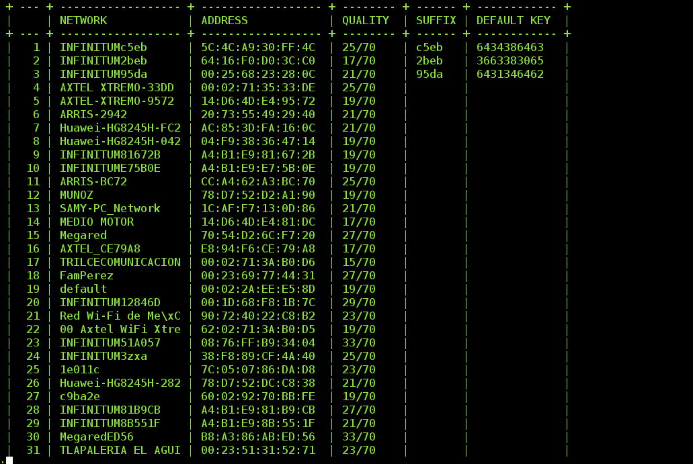

# wepscan.py

[](https://gitter.im/ksaver/wepscan?utm_source=badge&utm_medium=badge&utm_campaign=pr-badge&utm_content=badge)
Scan WiFi networks and show up default WEP keys for vulnerable Huawei access points.

## Usage:

### View arguments:
```bash
$ ./wepscan.py -h
usage: wepscan.py [-h] [-m MACADDRESS] [-i INTERFACE]

optional arguments:
  -h, --help            show this help message and exit
  -m MACADDRESS, --mac-address MACADDRESS
                        Mac address to wep key (formerly mac2wep).
  -i INTERFACE, --interface INTERFACE
                        WiFi interface to perform scanning.
```

### Get the default WEP key for a single MAC address:
```bash
$ ./wepscan.py -m 5C:4C:A9:30:FF:4C 
[+] SUFFIX: c5eb, DEFAULT WEP KEY: 6434386463
```

### Scan WiFi networks with normal user priviledges:
(It will show only the currently connected network..)
```bash
$ ./wepscan.py -i wlan0
 + -- + ------------------ + ------------------ + ------ + ------ + ------------ +
 |    | NETWORK            | ADDRESS            | SIGNAL | SUFFIX | DEFAULT KEY  |
 + -- + ------------------ + ------------------ + ------ + ------ + ------------ +
 |  1 | SKYNET             | 00:11:22:33:AA:FF  | 24/70  |        |              |
 + -- + ------------------ + ------------------ + ------ + ------ + ------------ +
```

### Scan WiFi networks with sudo or root priviledges:
```bash
$ sudo ./wepscan.py -i wlan0
```

